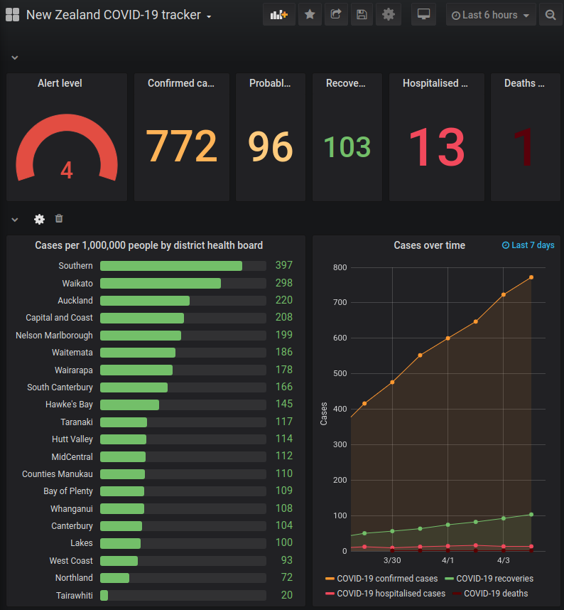

# NZ COVID-19 cases scraper

# UPDATE: online scraper API retried

After one too many arbitrary format changes on the MOH web site I've decided to stop updating the scraper and shut down the online API. There are alternative sources of both live statistics and case data (see section below).

For me, this project was an object lesson in the futility of scraping hand-edited information. Open Data is necessary for the public to (feasibly) automatically process government-owned data. It turns out, in a crisis,
Open Data is not a priority (indeed, as of 5 July 2020, in NZ the official government portal has [scant](https://catalogue.data.govt.nz/dataset?q=covid&sort=metadata_modified+desc) COVID-19 datasets).

Sorry for the inconvenience, and thank you for your interest.

# UPDATE: discontinuation of case detail scraping

On April 12, the MOH stopped publishing all COVID-19 case details in a single table, and began reporting monthly cases.
At this point I don't think it makes sense for this API to offer detailed case information. The last successfully scraped
case data is now [archived](archive_data/2020-04-11). I will leave the scraping code as is for those who want to use
the CLI tool to download the current month's case data.

Similarly, the location (per-DHB statistics) which were derived from scraped cases will now be incorrect, and MOH's
own per-DHB case summary table is also only for the current month. Again, I will remove the API for `/location/*` and
leave the CLI function in place, in case it is useful to anyone (unlikely, but who knows).

For those who are interested in obtaining a full snapshot of case information, the best source I know of is the via the
[arcgis.com dashboard linked from the MOH webste](https://experience.arcgis.com/experience/e4e58e39a0ec410eb054f42012a27b4b).
 
Specifically tables that appear to be obtained from, or maintained by [ESR](https://www.esr.cri.nz/) in the
backend web service, can be dumped in JSON format with the right query strings:

- [Daily_ESR_Update_Cases](https://services2.arcgis.com/9V7Qc4NIcvZBm0io/ArcGIS/rest/services/Daily_ESR_Update_Cases/FeatureServer/0/query?where=0%3D0&outFields=%2A&f=json)
- [Daily_ESR_Update_DHB](https://services2.arcgis.com/9V7Qc4NIcvZBm0io/ArcGIS/rest/services/Daily_ESR_Update_DHB/FeatureServer/0/query?where=0%3D0&outFields=%2A&f=json)

# UPDATE: real-time NZ COVID-19 statistics

[ESR](https://www.esr.cri.nz/) now provides a dashboard that (presumably) renders statistics directly from the
authoritative database that all the NZ COVID-19 comes from (EpiSurv): https://nzcoviddashboard.esr.cri.nz/

Unfortunately there is no usable API. As far as I can tell, R Shiny-server uses a baroque home-grown protocol. 
It exchanges strangely encoded messages (mixed with JSON) over streaming XHR connections:

```
Client: ["0#0|o|"]
Server: a["1#0|m|{\"busy\":\"busy\"}"]
```

If anyone feels there is significant value in reverse-engineering this, feel free to open an issue.

# Overview

This code is intended to scrape the following sources of COVID-19 data in New Zealand, and render the data in various formats suitable for mapping, visualisation and analysis:
 - Ministry Of Health COVID-19 [COVID-19 case page](https://www.health.govt.nz/our-work/diseases-and-conditions/covid-19-novel-coronavirus/covid-19-current-cases)
 - The government COVID-19 [alert level page](https://covid19.govt.nz/government-actions/covid-19-alert-level/) 

Use this with caution - the NZ government may change their pages and break the scraper at any time.

~~This code is used as the core of an API service I'm running: https://nzcovid19api.xerra.nz/~~

~~Courtesy of @gizmoguy, the metrics exported are scraped by a Prometheus server, and visualised on a 
[Grafana dashboard](https://nzcovid19.grafana.sla.ac/d/r4XZV79Wz/new-zealand-covid-19-tracker?orgId=1):~~



## Building

### Building directly

To build the utilities, you'll need a go 1.13+ toolchain installed (check out https://golang.org/dl/ for details).

Running `./build.sh` will build each tool in the `cmd/` subdirectories.

### Building with Docker

If you don't want to futz with Go, a Dockerfile is provided. Use [docker](https://docs.docker.com/install/) to build a container:

```
$ docker build -t nzcovid19cases .
<snip>
Successfully tagged nzcovid19cases:latest
```

## Usage

For now there is a CLI tool.

### Running the directly built binaries

```
cmd/nzcovid19-cli$ ./nzcovid19-cli 

Usage: ./cmd/nzcovid19-cli/nzcovid19-cli <action>
	Where <action> is one of:
		- cases/json
		- cases/csv
		- locations/json
		- locations/csv
		- alertlevel/json
		- casestats/json
		- clusters/json
		- clusters/csv
```

## Running the docker container

```
$ docker run -ti --rm nzcovid19cases alertlevel/json
{
  "Level": 4,
  "LevelName": "Eliminate"
}
```

## Code license

This code is published under the [MIT license](LICENSE.txt).

## Data copyright

The data processed by this tool is published under:
 - The [Ministry Of Health's copyright](https://www.health.govt.nz/about-site/copyright) which at the time
of writing is Creative Commons Attribution 4.0 International Licence with some exceptions.
 - The [Crown Copyright](https://www.iponz.govt.nz/about-ip/copyright/crown-copyright/).